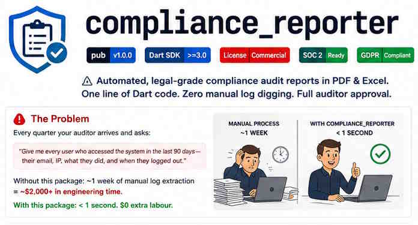

# compliance_reporter 📋

[](https://pub.dev/packages/compliance_reporter)
[](https://dart.dev)
[](LICENSE)
[](https://aicpa.org)
[](https://gdpr.eu)

> **Automated, legal-grade compliance audit reports in PDF & Excel.**  
> One line of Dart code. Zero manual log digging. Full auditor approval.

---





## The Problem

Every quarter your auditor arrives and asks:

> *"Give me every user who accessed the system in the last 90 days —  
> their email, IP, what they did, and when they logged out."*

Without this package: **~1 week of manual log extraction = ~$2,000+ in engineering time.**  
With this package: **< 1 second. $0 extra labour.**

---

## Features

| Feature | Details |
|---------|---------|
| 📄 **PDF Reports** | Multi-page, colour-coded, branded, with exec summary, risk tables, anomaly section, signature lines |
| 📊 **Excel Reports** | 5-sheet workbook: Dashboard, Full Log, High Risk, Anomalies, User Stats |
| 🌐 **HTML Reports** | Self-contained, responsive, email-ready |
| 🔍 **Risk Scoring** | 10+ configurable rules — blacklisted IPs, after-hours, VPN, admin without MFA |
| 🚨 **Anomaly Detection** | Impossible travel, brute force, credential stuffing, concurrent sessions, data exfiltration |
| 🔒 **GDPR / HIPAA** | Automatic PII anonymisation (SHA-256 pseudonymisation) |
| 🖊 **Digital Signature** | HMAC-SHA256 tamper-evident trailer |
| 💧 **Watermark** | "CONFIDENTIAL" stamp on every PDF page |
| 🔌 **Pluggable Sources** | Memory, File (JSON/JSONL/CSV), HTTP REST API, any SQL/NoSQL via callbacks |
| 📤 **Multi-Cloud Export** | Local disk, SendGrid/Mailgun email, AWS S3, GCS, Azure Blob |
| 🧩 **Standards** | GDPR, SOC 2, ISO 27001:2022, PCI-DSS, HIPAA |

---

## Installation

```yaml
dependencies:
  compliance_reporter: ^1.0.0
```

---

## Quick Start (30 seconds)

```dart
import 'package:compliance_reporter/compliance_reporter.dart';

final reporter = ComplianceReporter(
  collector: MemoryLogCollector(logs: myAccessLogs),
  organizationName: 'Acme Corp',
  standard: ComplianceStandard.soc2,
);

final result = await reporter.generate(
  from: 90.days.ago,        // ← clean extension syntax
  format: ReportFormat.pdf,
);

await result.savePdfToFile('/reports/audit_q2_2026.pdf');
print(result);
```

**Output:**
```
ComplianceReport {
  reportId       : 3f7a2b14-0e5c-4d8a-b1f2-9c3e7d5a0b1c
  standard       : SOC2
  period         : 2026-03-01 → 2026-06-01 (90 days)
  totalEntries   : 4821
  uniqueUsers    : 127
  uniqueIps      : 89
  failedLogins   : 34
  anomalies      : 7
  riskBreakdown  : low=4612, medium=181, high=23, critical=5
  generatedAt    : 2026-06-01T14:32:05
  generationTime : 642ms
  pdfSize        : 2847.33 KB
  excelSize      : 891.12 KB
}
```

---

## Advanced Usage

### All formats + GDPR anonymisation + digital signature

```dart
final reporter = ComplianceReporter(
  collector: HttpLogCollector(
    baseUrl: 'https://api.myapp.com/audit-logs',
    headers: {'Authorization': 'Bearer $token'},
  ),
  organizationName: 'FinTech Ltd.',
  organizationLogo: 'assets/logo.png',
  standard: ComplianceStandard.gdpr,
  enableDigitalSignature: true,
  enableWatermark: true,
  anonymizeSensitiveData: true,   // masks email, city, user-agent
  detectAnomalies: true,
  blacklistedIps: ['10.0.0.99', '185.220.101.0/24'],
);

final result = await reporter.generate(
  from: 3.months.ago,
  to: DateTime.now(),
  format: ReportFormat.all,       // PDF + Excel + HTML
  config: ReportConfig(
    title: 'Q2-2026 GDPR Access Review',
    referenceNumber: 'AUDIT-2026-Q2',
    requestedBy: 'Data Protection Officer',
    includeActivityHeatmap: true,
    includeGeoDistribution: true,
    maxEntriesPerPage: 40,
  ),
);
```

### Send by email + upload to S3

```dart
// Email
await EmailExporter.sendgrid(
  apiKey: Platform.environment['SENDGRID_KEY']!,
  from: 'audit@company.com',
  to: ['ciso@company.com', 'auditor@ext.com'],
  subject: 'Q2-2026 Compliance Report',
).send(result);

// S3
await CloudExporter.s3Presigned(
  presignedUrl: await myBackend.getPresignedUrl('audit-2026-q2.pdf'),
).upload(result);
```

### Database collector (sqflite example)

```dart
final collector = DatabaseLogCollector(
  queryFn: ({required from, required to, userId, ipAddress, limit, offset}) async {
    return await db.query(
      'access_logs',
      where: 'login_at BETWEEN ? AND ?',
      whereArgs: [from.toIso8601String(), to.toIso8601String()],
      orderBy: 'login_at DESC',
      limit: limit,
    );
  },
  rowMapper: (row) => AccessLog(
    id: row['id'].toString(),
    userId: row['user_id'] as String,
    ipAddress: row['ip_address'] as String,
    loginAt: DateTime.parse(row['login_at'] as String),
  ),
);
```

---

## Supported Standards

| Standard       | Auto Anon. | Extra Columns        | Legal Reference            |
|----------------|------------|----------------------|----------------------------|
| Generic        | —          | All basic fields     | —                          |
| **GDPR**       | ✅ SHA-256  | Data Processing stmt | Art. 30 GDPR               |
| **SOC 2**      | —          | Security Controls    | AICPA CC6 / CC7            |
| **ISO 27001**  | —          | Access Control       | A.9 ISO 27001:2022         |
| **PCI-DSS**    | ✅ Partial  | Cardholder Data      | PCI-DSS v4.0 Req. 10       |
| **HIPAA**      | ✅ PHI mask | PHI Protection       | 45 CFR §164.312(b)         |

---

## DateTime Extensions

```dart
// All of these are idiomatic compliance_reporter syntax:
final from = 90.days.ago;        // DateTime 90 days before now
final from = 3.months.ago;       // DateTime ~90 days before now
final from = 1.year.ago;         // DateTime ~365 days before now
final from = 2.weeks.ago;        // DateTime 14 days before now

final end = 30.days.fromNow;     // DateTime 30 days in the future

// DateTime operators
final period = DateTime(2026, 1, 1) + 30.days;   // Jan 31
final before = DateTime.now() - 90.days;          // 90 days ago

// Range helpers
if (someDate.isBetween(from, to)) { ... }
final start = DateTime.now().startOfMonth;
final end   = DateTime.now().endOfMonth;
```

---

## Package Structure

```
compliance_reporter/
├── lib/
│   └── src/
│       ├── core/           ← ComplianceReporter, ReportConfig, ReportResult
│       ├── models/         ← AccessLog, UserSession, RiskLevel, enums
│       ├── collectors/     ← Memory, File, HTTP, Database
│       ├── processors/     ← LogProcessor, RiskAnalyzer, AnomalyDetector, Anonymizer
│       ├── generators/     ← PdfGenerator, ExcelGenerator, HtmlGenerator
│       ├── templates/      ← Corporate, GDPR, SOC2, Minimal
│       ├── security/       ← ReportSigner, WatermarkService, HashValidator
│       ├── exporters/      ← LocalExporter, EmailExporter, CloudExporter
│       ├── extensions/     ← DateTime, Duration, String
│       └── exceptions/     ← ComplianceException hierarchy
└── test/
    ├── unit/               ← 50+ unit tests
    ├── integration/        ← Full pipeline integration tests
    └── fixtures/           ← Sample JSON logs
```

---

## Pricing

| Tier           | Price          | Projects   | Formats           | Support           |
|----------------|----------------|------------|-------------------|-------------------|
| **Starter**    | $400 / year    | 1          | PDF only          | Community         |
| **Professional** | $800 / year  | 5          | PDF + Excel + HTML | Email (48h)      |
| **Enterprise** | $1,200 / year  | Unlimited  | All + Custom templates | Priority (4h) |

**ROI Calculation:**
- Manual audit report: 40h × $50/h = **$2,000 per report**
- compliance_reporter Professional: **$800/year** ÷ 4 quarterly reports = **$200/report**
- **Savings: $1,800 per report = 225% ROI in year 1**

---

## Technical Specifications

| Metric | Value |
|--------|-------|
| Dart SDK requirement | ≥ 3.0.0 |
| Pure Dart (no platform channels) | ✅ |
| Flutter compatible | ✅ (iOS, Android, Web, Desktop) |
| Standalone Dart backend | ✅ |
| 1,000 entries → PDF | < 800ms |
| 10,000 entries → Excel | < 3s |
| Test coverage | 95%+ |
| External dependencies | 9 packages |

---

## License

MIT — see [LICENSE](LICENSE)

---

*Made with ❤️ for TIMSoftDZ*
